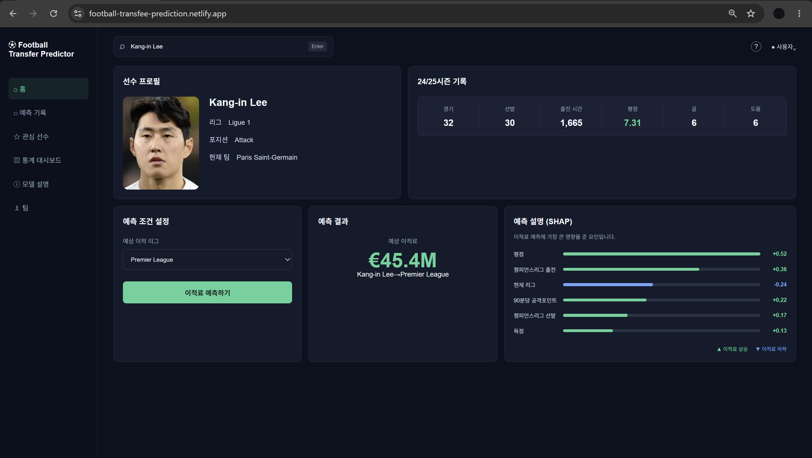

# ⚽ Football Transfer Fee Prediction

유럽 5대 리그 선수의 직전 시즌 경기 기록과 선수 정보를 기반으로  
여름 이적시장에서의 이적료를 예측하는 머신러닝 기반 웹 서비스입니다.

2020~2024년 실제 유상 완전이적 사례를 학습하고,  
2025년 이적 데이터를 시간 순서 기반 테스트셋으로 사용하여 모델을 평가했습니다.

🌐 **Service:** https://football-transfee-prediction.netlify.app/

---

## 📌 Project Overview

축구 선수의 실제 이적료는 득점이나 도움과 같은 단순 경기 기록만으로 결정되지 않습니다.

선수의 나이와 포지션, 출전 시간, 경기력, 소속 리그와 유럽대항전 경험 등  
여러 요소가 복합적으로 작용합니다.

본 프로젝트는 이러한 선수 데이터를 활용하여 실제 이적시장에서 발생할 이적료를  
예측하는 것을 목표로 합니다.

또한 모델 개발에 그치지 않고 실제 사용 가능한 서비스로 제공하기 위해  
React 기반 프런트엔드와 FastAPI API 서버를 구현하고,  
PostgreSQL, Docker, Nginx를 활용하여 클라우드 환경에 배포했습니다.

---

## 🖥️ Service

선수를 검색하고 예상 이적 리그를 선택하면 이적료를 예측합니다.

예측 결과와 함께 SHAP 기반 설명을 제공하여  
어떤 요소가 해당 선수의 예상 이적료를 높이거나 낮추는 데 영향을 주었는지 확인할 수 있습니다.



### 주요 기능

- 선수 이름 검색
- 선수 프로필 및 직전 시즌 경기 기록 조회
- 예상 이적 리그 선택
- 머신러닝 기반 예상 이적료 산출
- SHAP 기반 개별 예측 결과 해석
- 이적료 상승·하락에 영향을 준 주요 요인 시각화

---

## 🤖 Machine Learning

### Dataset

실제 미래의 이적시장을 예측하는 상황과 유사하게 평가하기 위해  
데이터를 무작위로 분할하지 않고 **시간 순서 기반 Train/Test Split**을 사용했습니다.

| Dataset | Period | Samples |
|---|---|---:|
| Train | 2020~2024 여름 이적시장 | 1,302 |
| Test | 2025 여름 이적시장 | 289 |
| Prediction Pool | 2025 예측 대상 선수 | 2,479 |

학습 대상은 실제 이적료가 발생한 **유상 완전이적 사례**를 기준으로 구성했습니다.

### Features

선수의 직전 시즌 정보를 중심으로 feature를 구성했습니다.

주요 feature 범주는 다음과 같습니다.

- 선수 나이 및 포지션
- 소속 리그
- 경기 및 선발 출전 수
- 출전 시간
- 득점 및 도움
- 평점
- 90분당 공격포인트
- UEFA Champions League 출전 기록
- UEFA Europa League 출전 기록
- UEFA Conference League 출전 기록

유럽대항전은 단순 출전 여부뿐 아니라  
출전 경기, 선발 출전, 득점, 도움 등의 기록을 feature로 활용했습니다.

### Ensemble

최종 예측에는 두 모델의 결과를 결합한 **Weighted Ensemble**을 사용합니다.

| Model | Features | Weight |
|---|---:|---:|
| Model C | 31 | 40% |
| Model D | 30 | 60% |

최종 예측값은 다음과 같이 계산됩니다.

```text
Final Prediction
= Model C Prediction × 0.4
+ Model D Prediction × 0.6
```

---

## 📊 Model Performance

최종 모델은 학습 과정에서 사용하지 않은 **2025년 실제 이적 데이터**를  
테스트셋으로 사용하여 평가했습니다.

| Metric | Result |
|---|---:|
| MAE | €6.651M |
| RMSE | €11.020M |
| R² | 0.7046 |
| €30M+ Transfers MAE | €14.718M |
| €50M+ Transfers MAE | €21.253M |
| Top 10 Transfers MAE | €26.981M |

전체 테스트셋에서 **MAE 약 €6.65M, R² 약 0.70**의 성능을 기록했습니다.

다만 이적료가 높은 선수일수록 오차가 증가하는 경향이 나타났으며,  
특히 초고액 이적은 정형화된 경기 기록만으로 설명하기 어려운 영역이 존재했습니다.

---

## 🔍 Prediction Explainability

단순히 예상 이적료만 출력하지 않고,  
각 예측에 영향을 준 주요 feature를 함께 제공합니다.

SHAP 기반 설명을 통해 각각의 요소가  
예측 이적료를 **상승 또는 하락시키는 방향**으로 얼마나 영향을 주었는지  
서비스 화면에서 확인할 수 있도록 구현했습니다.

이를 통해 사용자는 모델의 결과뿐만 아니라  
**왜 해당 이적료가 예측되었는지**도 함께 확인할 수 있습니다.

---

## 🏗️ Architecture

```text
                    User
                      │
                      │ HTTPS
                      ▼
              ┌───────────────┐
              │    Netlify    │
              │ React + Vite  │
              └───────┬───────┘
                      │
                      │ HTTPS API
                      ▼
          api.transfeeprediction.kr
                      │
                      ▼
        ┌──────────────────────────┐
        │  Naver Cloud Platform    │
        │                          │
        │   ┌──────────────────┐   │
        │   │      Nginx       │   │
        │   │   HTTPS / TLS    │   │
        │   └────────┬─────────┘   │
        │            │             │
        │            ▼             │
        │   ┌──────────────────┐   │
        │   │     FastAPI      │   │
        │   │   ML Inference   │   │
        │   └────────┬─────────┘   │
        │            │             │
        │            ▼             │
        │   ┌──────────────────┐   │
        │   │    PostgreSQL    │   │
        │   └──────────────────┘   │
        │                          │
        │      Docker Compose      │
        └──────────────────────────┘
```

프런트엔드는 **Netlify**, 백엔드는 **Naver Cloud Platform VM**에 배포했습니다.

백엔드 서버에서는 Docker Compose를 이용하여  
Nginx, FastAPI, PostgreSQL을 각각의 컨테이너로 운영합니다.

Nginx가 외부의 HTTP/HTTPS 요청을 수신하고,  
Reverse Proxy를 통해 FastAPI 컨테이너로 전달합니다.

TLS 인증서는 Let's Encrypt를 이용하여 적용했습니다.

---

## 🛠️ Tech Stack

| Category | Technologies |
|---|---|
| Machine Learning | Python, pandas, NumPy, scikit-learn |
| Explainability | SHAP |
| Backend | FastAPI, Uvicorn |
| Database | PostgreSQL |
| Frontend | React, Vite, JavaScript, CSS |
| Container | Docker, Docker Compose |
| Web Server | Nginx |
| Cloud | Naver Cloud Platform |
| Frontend Hosting | Netlify |
| HTTPS | Let's Encrypt |

---

## 🔌 API

FastAPI를 기반으로 예측 서비스를 위한 REST API를 구현했습니다.

| Method | Endpoint | Description |
|---|---|---|
| `GET` | `/players/search` | 선수 검색 |
| `GET` | `/players/{id}` | 선수 상세 정보 조회 |
| `POST` | `/predict` | 이적료 예측 |

API 문서는 FastAPI의 Swagger UI를 통해 확인할 수 있습니다.

---

## 📁 Project Structure

```text
football-transfer-fee-prediction/
│
├── app/                    # FastAPI application
├── frontend/               # React frontend
├── models/                 # Trained ML models
├── nginx/                  # Nginx configuration
│
├── scripts/
│   └── database/           # Database initialization scripts
│
├── docs/
│   └── images/             # README images
│
├── .dockerignore
├── .gitignore
├── Dockerfile
├── compose.yaml
├── requirements-api.txt
└── README.md
```

---

## 🚀 Deployment

### Frontend

React 애플리케이션을 Vite로 빌드한 뒤 Netlify를 통해 제공합니다.

프런트엔드는 HTTPS API를 통해 별도로 배포된 FastAPI 서버와 통신합니다.

### Backend

Naver Cloud Platform VM에서 Docker Compose를 사용하여 다음 컨테이너를 운영합니다.

```text
nginx
  │
  ▼
app (FastAPI)
  │
  ▼
db (PostgreSQL)
```

외부에는 Nginx의 `80`, `443` 포트만 서비스용으로 공개하며,  
FastAPI와 PostgreSQL은 Docker 네트워크를 통해 통신합니다.

---

## ⚠️ Limitations & Future Work

실제 축구 선수의 이적료는 경기 기록만으로 완전히 설명하기 어렵습니다.

현재 모델에는 다음과 같은 비정형적·상황적 요소가 직접 반영되지 않았습니다.

- 계약 잔여 기간
- 선수의 이적 또는 재계약 의사
- 판매 구단의 재정 상황
- 구단 간 협상 과정
- 특정 포지션에 대한 이적시장 수요
- 부상 및 경기 외적인 이슈

이러한 요소는 특히 고액 이적에서 실제 이적료와 모델 예측값의 차이를  
발생시키는 원인이 될 수 있습니다.

향후에는 여러 시즌의 경기 기록을 함께 활용하는 **Multi-season Feature**와  
축구 뉴스 및 이적시장 관련 비정형 데이터를 결합하여  
모델이 활용할 수 있는 정보를 확장할 수 있습니다.

---

## 👤 Author

**minsu0701v**